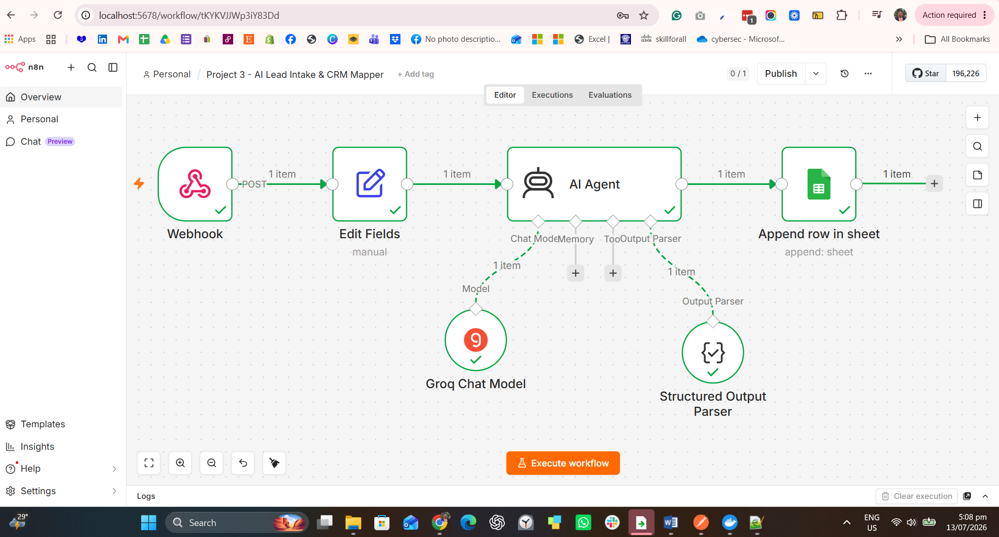
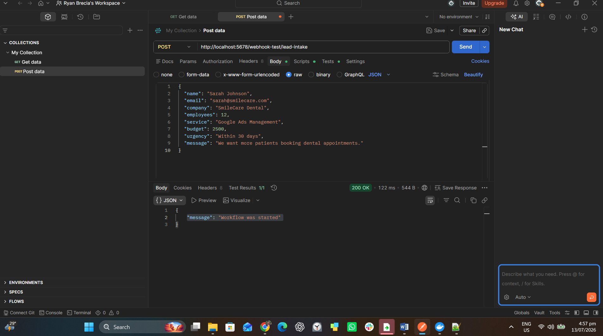
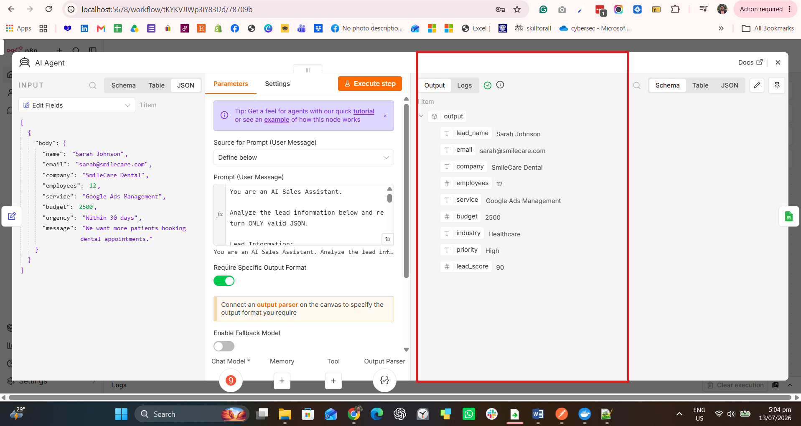
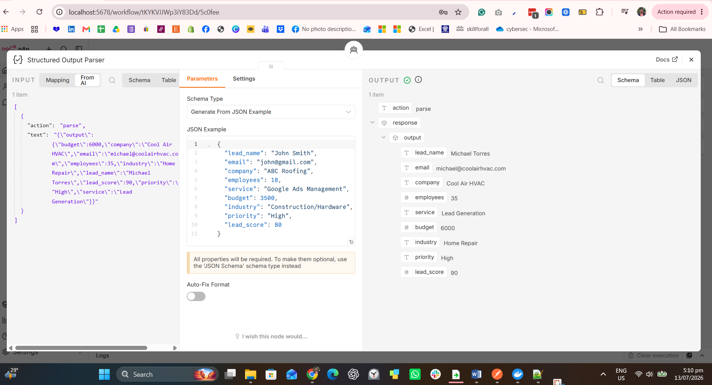
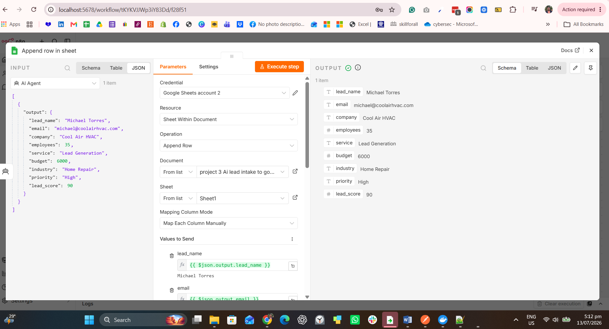
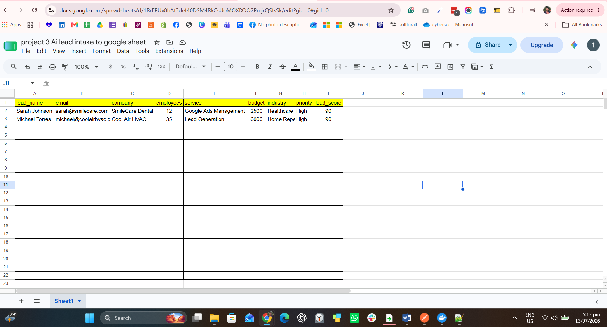

# 🤖 AI Lead Intake & Qualification System

An AI-powered lead intake automation built with **n8n** that captures incoming leads, analyzes lead information using AI, and automatically organizes qualified prospects into Google Sheets.

## 🚀 Project Overview

This workflow demonstrates how businesses can automate their lead management process.

Instead of manually reviewing every inquiry, the automation receives lead data through a webhook, uses AI to evaluate the lead quality, and stores the organized information for sales follow-up.

## 🛠️ Tools & Technologies

- n8n (Self-hosted automation platform)
- AI Agent
- Groq LLM API
- Webhook
- Google Sheets
- JSON Data Processing

## 🔄 Workflow Process

1. Lead submits information through a webhook
2. n8n receives the lead data as JSON
3. AI Agent analyzes the lead details
4. AI generates lead qualification insights
5. Lead information is saved into Google Sheets

## 📋 Example Lead Input

```json
{
  "name": "John Smith",
  "email": "john@gmail.com",
  "company": "ABC Roofing",
  "employees": 18,
  "service": "Google Ads Management",
  "budget": 3500,
  "urgency": "ASAP",
  "message": "We want more roofing leads."
}

## 📸 Workflow Screenshots

### 1. Workflow Overview

Complete n8n workflow showing the automation flow from lead intake, AI processing, structured output, and data storage.



---

### 2. Webhook API Testing with Postman

Postman was used to simulate a real client lead submission by sending a POST request to the n8n webhook endpoint.

The request contains lead information in JSON format, similar to data that could come from a website form, landing page, or external application.



---

### 3. AI Lead Analysis Output

The AI Agent processes the submitted lead information and generates qualification insights based on customer requirements, budget, and urgency.



---

### 4. Structured Output Parser

The Structured Output Parser ensures that the AI-generated response follows a consistent format, making the information easier to process and store in the next automation steps.



---

### 5. Google Sheets Node Configuration

The Google Sheets node in n8n is configured to automatically map and send the processed lead information into a spreadsheet.



---

### 6. Google Sheets Lead Database Output

The final qualified lead data is stored in Google Sheets, creating an organized lead database that can be reviewed for sales follow-up.



## 💡 Business Use Case

This automation can help businesses:

- Capture leads automatically from different sources
- Reduce manual data entry tasks
- Qualify prospects faster using AI
- Organize customer information in one place
- Improve sales response time
- Create a foundation for future CRM integration

---

## 👨‍💻 Skills Demonstrated

- Webhook API integration
- JSON data handling
- AI automation workflow design
- Lead qualification systems
- Google Sheets automation
- Data mapping and processing
- n8n workflow development
- No-code/low-code automation

---

## 👨‍💻 Author

**Ryan Brecia**

I am an aspiring AI Automation Specialist with a background in Information Technology and a passion for building practical automation solutions.

My focus is creating AI-powered workflows that help businesses reduce repetitive tasks, improve efficiency, and streamline their operations using tools such as n8n, AI agents, APIs, and automation platforms.

Through hands-on projects, I am continuously developing skills in workflow automation, AI integration, CRM systems, and digital marketing technology.
